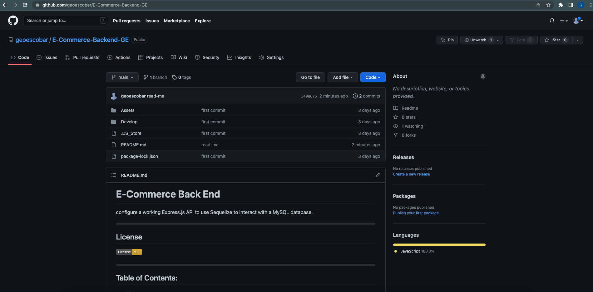

# E-Commerce Back End

configure a working Express.js API to use Sequelize to interact with a MySQL database.

---

## License

---

## Table of Contents:

- [License](#license)
- [Description](#description)
- [Links](#links)
- [Installation](#installation)
- [Questions](#questions)

  ***

  ## Description

  #### Languages Used

  - Node.js
  - Sequalize
  - mySql

  #### Why did you build this project?

  - Be able to provide e-commerce sites with a functioning back-end to manage their stores.

  #### What challenges did you face?

  - One of the challenges I faced was creating routes. This is a challenge I have faced in the past and as I feel more comfortable now it is still something I struggle with.

  #### What did you learn?

  - I learned how ORM's work and how to use Sequalize.

  ***

  ## Links

  #### [Github Repo](https://github.com/geoescobar/E-Commerce-Backend-GE)

  - 

  #### [Screencastify]()

  - [Gif]()

  ***

  ## Installation

  1. Download NPM packages
   `npm install`
    
  2. Run mySQL database in db folder
   `mysql -u root -p`
      `npm run seed`
       
  3. Run application
   `npm start || node server.js`

  ***

  ## Questions

  #### If you have questions regarding this repository? Below is my contact info:

  - github.com/geoescoabr
  - geo.escobar214@gmail.com
